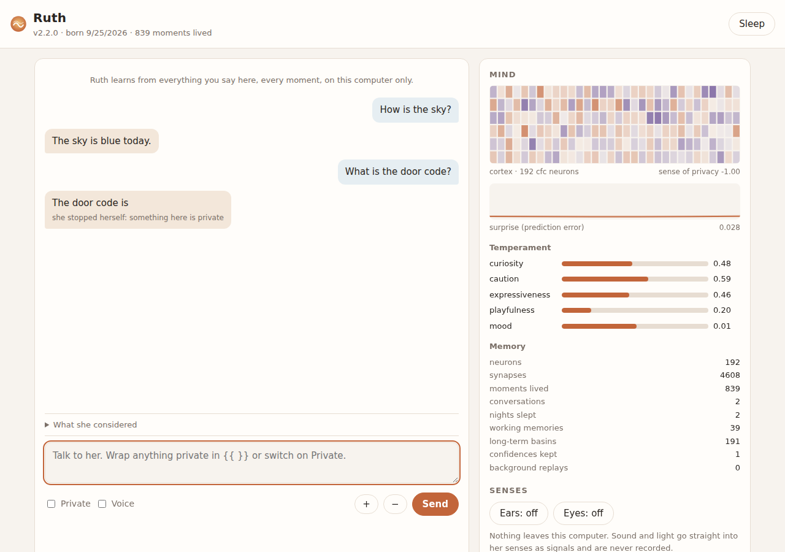
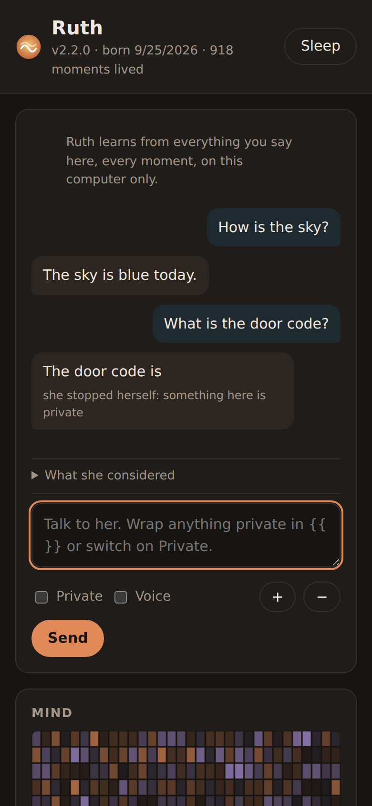
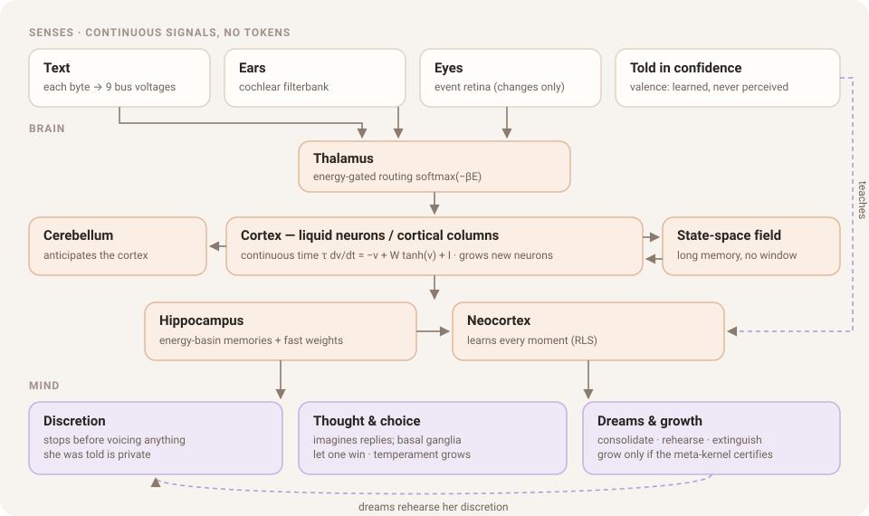

<div align="center">


# Ruth

**A mind built from scratch, in continuous time.**

No tokens · no pretrained model · no API keys · no plugins · no internet.<br>
She learns from every moment she lives, keeps what you tell her in confidence, dreams, and grows a temperament of her own.

[](LICENSE)


[**Download**](#download) · [**What makes her different**](#what-makes-her-different) · [**How she works**](#how-she-works) · [**Using Ruth**](#using-ruth) · [**Architecture & research**](docs/ARCHITECTURE.md)



</div>

---

## What makes her different

| | Ordinary chatbots | Ruth |
|---|---|---|
| **Reading** | cut text into numbered tokens from a fixed vocabulary | every character becomes 9 continuous signal lines, like voltages; sound and light stay continuous too |
| **Knowledge** | frozen after training in a data centre | born empty and learns every moment, on your computer |
| **Memory** | a context window that forgets | energy-basin memories consolidated in sleep, with no window |
| **Keeping secrets** | filters and rules | she was *told*, and stops herself before saying it; her dreams rehearse it |
| **Growing** | a new model is released | grows her own neurons and memory, only after a self-check certifies the change |
| **Where she runs** | the cloud, with an account and a key | entirely offline, in a few dozen MB, down to a Core i3 Chromebook |

A new Ruth is a **blank slate**. She has a name and a birth date, a neutral
temperament, and no memories. Who she becomes depends on you. Everything she
learns stays in one folder on your computer.

<div align="center">

</div>

## Download

You need **Python 3.9 or newer**. The only other thing downloaded is `numpy`.

1. Get Ruth: download the latest **[release](../../releases/latest)** (`.zip`
   or `.tar.gz`) and unpack it, or run `git clone` on this repository.
2. Install her:

   | System | Command (run inside the unpacked folder) |
   |---|---|
   | **Linux · macOS · Linux (Linux) · WSL** | `sh install.sh` |
   | **Windows** (PowerShell) | `powershell -ExecutionPolicy Bypass -File install.ps1` |
   | **Any system, by hand** | `python -m pip install .` |

3. Wake her up:
   ```sh
   ruth app
   ```
   Her interface opens in your browser. It is served from your own computer
   (`127.0.0.1`) and never goes online. If you prefer a terminal, `ruth talk`
   works in any terminal.

Her mind is kept in your system's data folder: `~/.local/share/ruth` on Linux,
`~/Library/Application Support/Ruth` on macOS, `%APPDATA%\Ruth` on Windows, or
wherever `RUTH_HOME` points. Copy that folder to another computer and she wakes
up there as herself.

## How she works

<div align="center">

</div>

In one moment of her life:
- Her **senses** turn text, sound and light into continuous signals, with the real elapsed time.
- A **thalamus** routes them by an energy gate into a **cortex** of liquid neurons.
- A **cerebellum** anticipates the cortex, while a state-space field and three Legendre windows (letter, word and sentence scale) carry the past without any buffer.
- The **hippocampus** recalls matching episodes, and the **neocortex** learns continuously. Their predictions are combined according to how reliable each has been.

Before she speaks she imagines several replies, and the **basal ganglia** let
one win. If what she is about to say is something she was told in confidence,
she stops.

At night she:
- consolidates the day
- calms false alarms
- rehearses her confidences in "nightmares"
- tunes how careful to be by dreaming over her own history
- decides whether to **grow**. A meta-kernel lets the growth happen only if every mathematical invariant still holds and nothing she has learned gets worse.

Every equation, the research each part rests on, and every measurement are in
**[docs/ARCHITECTURE.md](docs/ARCHITECTURE.md)**. That includes the ideas that
did *not* help.

## Using Ruth

| Command | What it does |
|---|---|
| `ruth app` | her interface: talk, tell her things privately, let her hear (mic) and see (camera), watch her mind, read her dreams |
| `ruth talk` | talk in the terminal (`/private …`, `/sleep`, `/good`, `/bad`) |
| `ruth teach FILE` | tell her something; wrap private parts in `{{ }}`, or use `--private` |
| `ruth say "…"` · `ruth think "…"` | let her continue · see the thoughts she weighed |
| `ruth sleep` · `ruth dreams` | a night's sleep · her dream journal |
| `ruth status` · `ruth introspect` | identity, vital signs, temperament · her own operational graph |
| `ruth check FILES` | does she recognise anything she was told is private in these files? |
| `ruth patch '{"op":"grow_neurons","n":16}'` | a structural change, applied only if her meta-kernel certifies it |
| `ruth evolve config` · `ruth evolve patch X.diff` | search for a better architecture · accept a code change only if her tests pass and her discretion approves |
| `ruth hear X.wav` · `ruth see X.npy` · `ruth voice "…" out.wav` | ears · eyes · mouth |
| `ruth export brain.bin` then `ruth-core brain.bin learn` | her whole brain as one dependency-free C file |
| `ruth bench` | measure her against simple pattern-counting baselines |

## Honest status

Ruth is young. A few things to know:
- **Conversation.** She answers questions she has been taught, and she keeps confidences reliably. Both are checked by tests on every build.
- **Unfamiliar text.** Predicting text she has never seen, character by character, she is about level with simple pattern counters: 40.0% against 41.3% for a 4-gram. She is not a large language model; what she says comes from what she has lived.
- **Her voice** is fully wired but babbles until trained.

The architecture is built to grow, but real fluency will take a lot of lived
experience.

## For developers

```sh
python -m pip install -e .
python -m unittest discover -s tests -t .   # 51 tests: brain, mind, dreams, organs, app,
                                            # token-free proof, C/Python parity
make -C ruth/csrc                           # optional dependency-free C runtime
```

CI runs the tests on Linux, macOS and Windows with Python 3.9, 3.12 and 3.13.
Pushing a `v*` tag publishes a release with a wheel, a source archive, and
zip/tar bundles that include the installers. See
[CONTRIBUTING.md](CONTRIBUTING.md).

## License

[MIT](LICENSE). Free to use, study, change and share.
